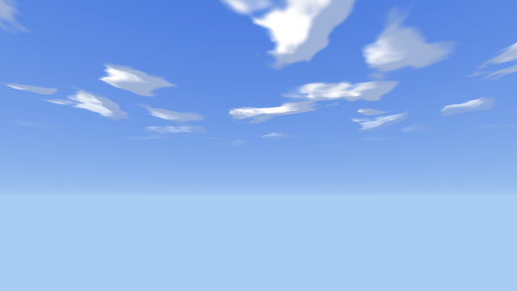
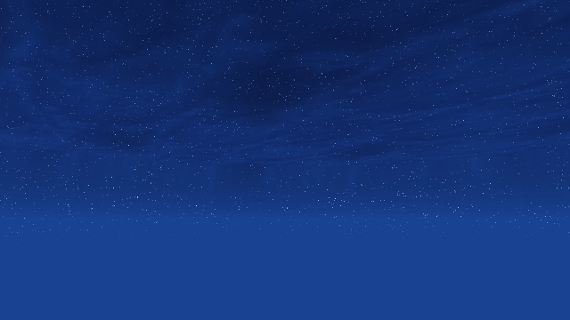

# OctaveSkies

Procedural skybox packs for the [Octave-libogc](https://github.com/myuu-151/Octave-libogc) game engine — built for GameCube/Wii-class rendering.
| Day | Night |
|---|---|
|  |  |

## SkyboxDay

Windward-style daytime sky: horizon-to-zenith gradient, toon-shaded FBM clouds with two-tone sun lighting, wind-scrolled on a camera-anchored dome.

- Single dome mesh (`SM_SkyDome`), single material (`M_Sky`), 3 TEV stages: gradient → clouds (decal) → horizon haze
- `Sky.lua` scrolls the cloud UVs and pins the dome to the active camera

## SkyboxNight

Nebula night sky: near-black navy zenith, azure horizon glow, volume nebula veil with dark gaps, dense twinkling starfield with warm/cool tints and star-fall dipping just below the horizon.

- Two meshes: `SM_SkyDomeNight` (opaque: gradient + stars + haze, fisheye-mapped star layer) and `SM_CloudDomeNight` (translucent nebula clouds, wind-scrolled, child of the sky dome)
- `SkyNight.lua` drives the wind scroll and a sub-texel UV twinkle that pulses each star dim → bright → dim (tunable `twinkle` / `twinkleSpeed` / `windSpeed` / `starSpeed` properties)

## Contents (per pack)

- `*.oct` — engine-ready assets (textures, materials, meshes); drop into your project's `Assets/` folders
- `*.lua` — the sky script; goes in your project's `Scripts/` folder, assigned to the dome node's Script field
- `gen_sky_*.py` — the procedural generator that bakes everything (palette, coverage, star density etc. are constants at the top; writes `.oct` files directly)
- `*_rgb.png` / `*_alpha.png` — viewable exports of the baked textures
- `proj/` — a standalone Octave project (open the `.octp` in the editor); includes a packaged GameCube `.dol` under `proj/Packaged/`

## Setup in your own project

1. Copy the `.oct` files into `Assets/Textures`, `Assets/Materials`, `Assets/Meshes` (any subfolders work — Octave discovers recursively)
2. Copy the `.lua` script into `Scripts/`
3. Spawn a `StaticMesh3D` node, set its Static Mesh to the dome (`SM_SkyDome` / `SM_SkyDomeNight`) and its Script field to `Sky` / `SkyNight`
4. Night only: add a second `StaticMesh3D` as a **child** of the sky dome with mesh `SM_CloudDomeNight` (no script needed)

Textures are desktop-format RGBA8; the editor cooks them to GX formats automatically when packaging for GameCube/Wii.

> Note: night's translucent cloud layer depends on a Vulkan shader fix for TEV Decal alpha parity ([Octave-libogc commit 44d4d6c](https://github.com/myuu-151/Octave-libogc/commit/44d4d6cd581f1a74a5d108c201ee74fbf944536e)) to preview correctly in the editor; GameCube hardware renders it correctly regardless.
